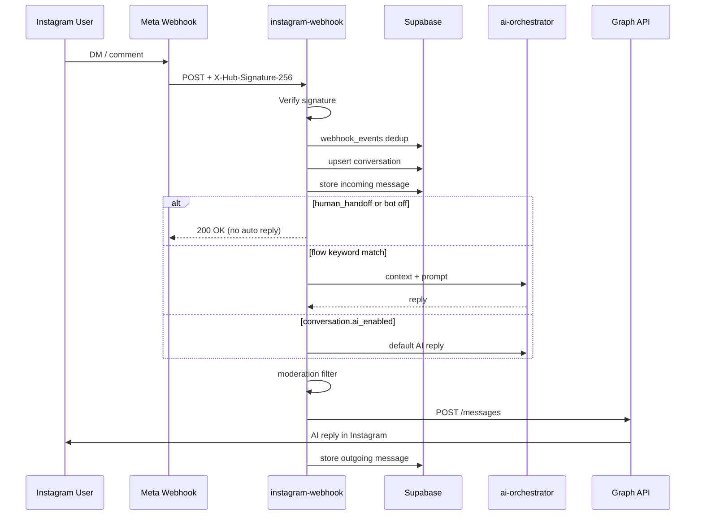

# Instagram AI Agent — Architecture Blueprint

This document maps your **MASTER FLOW PROMPT** to the **InstaFlow / InstaAutomate** codebase.

## Stack mapping

| Blueprint | This project |
|-----------|----------------|
| Next.js backend | **Supabase Edge Functions** (`instagram-webhook`, `ai-reply`, `send-dm`) |
| POST /api/webhook/instagram | `POST …/functions/v1/instagram-webhook` |
| Supabase DB + Realtime | ✅ PostgreSQL + RLS |
| OpenRouter gateway | ✅ Optional via `OPENROUTER_API_KEY` |
| Dashboard | Vanilla HTML/JS (`inbox.html`, `dashboard.html`, `flows.html`) |

## End-to-end flow (implemented)



## Core modules

| File | Role |
|------|------|
| `supabase/functions/instagram-webhook/index.ts` | Webhook verify, dedup, DM + comment pipeline |
| `supabase/functions/_shared/conversation-store.ts` | Conversations, messages, account lookup |
| `supabase/functions/_shared/ai-orchestrator.ts` | Context, memory summary, OpenRouter / ai-reply |
| `supabase/functions/_shared/moderation.ts` | Banned keywords, length, spam patterns |
| `supabase/functions/_shared/instagram-api.ts` | Send reply via Graph API |

## Database (run migrations)

1. `supabase/migrations/20260522_instaflow_pro_foundation.sql`
2. `supabase/migrations/20260522_ai_agent_pipeline.sql`

Key tables: `conversations`, `messages`, `ai_settings`, `flows`, `webhook_events`, `conversation_memory`.

## Human vs AI mode

| Mode | DB flags | Behavior |
|------|----------|----------|
| AI MODE | `bot_enabled=true`, `ai_enabled=true`, `human_handoff=false` | Auto AI when no keyword flow matches |
| BOT OFF | `bot_enabled=false` | Store messages only |
| HUMAN MODE | `human_handoff=true` | No auto replies; operator uses inbox |

Toggle from **Inbox** → per-conversation AI toggle (wired to `conversations.ai_enabled`).

## Deploy checklist

```bash
supabase functions deploy instagram-webhook
supabase functions deploy ai-reply
supabase functions deploy send-dm
```

Secrets: `WEBHOOK_VERIFY_TOKEN`, `INSTAGRAM_APP_SECRET`, `SUPABASE_SERVICE_ROLE_KEY`, optional `OPENROUTER_API_KEY`.

Meta webhook URL: `https://<project>.supabase.co/functions/v1/instagram-webhook`

## Future (from blueprint)

- pgvector embeddings in `conversation_memory`
- Redis / `event_queue` workers for delays and follow-ups
- Stripe/Razorpay billing gates
- WhatsApp / multichannel
